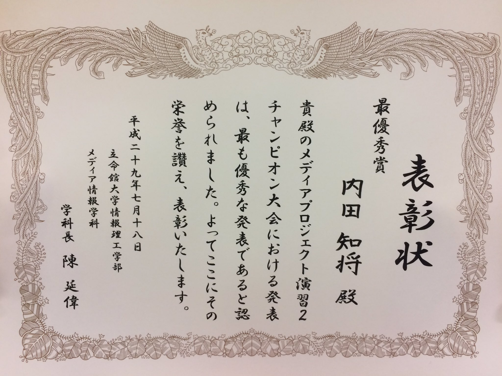
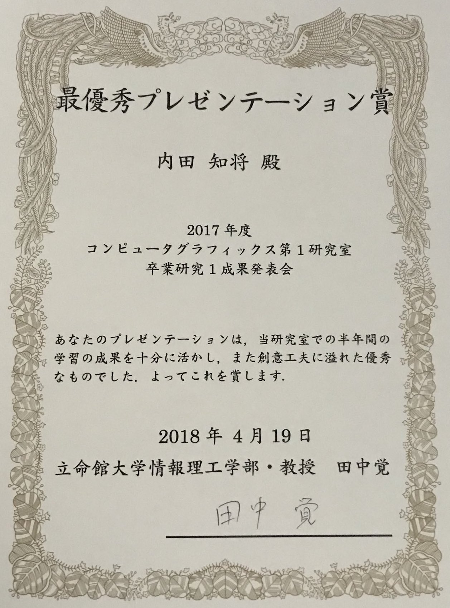
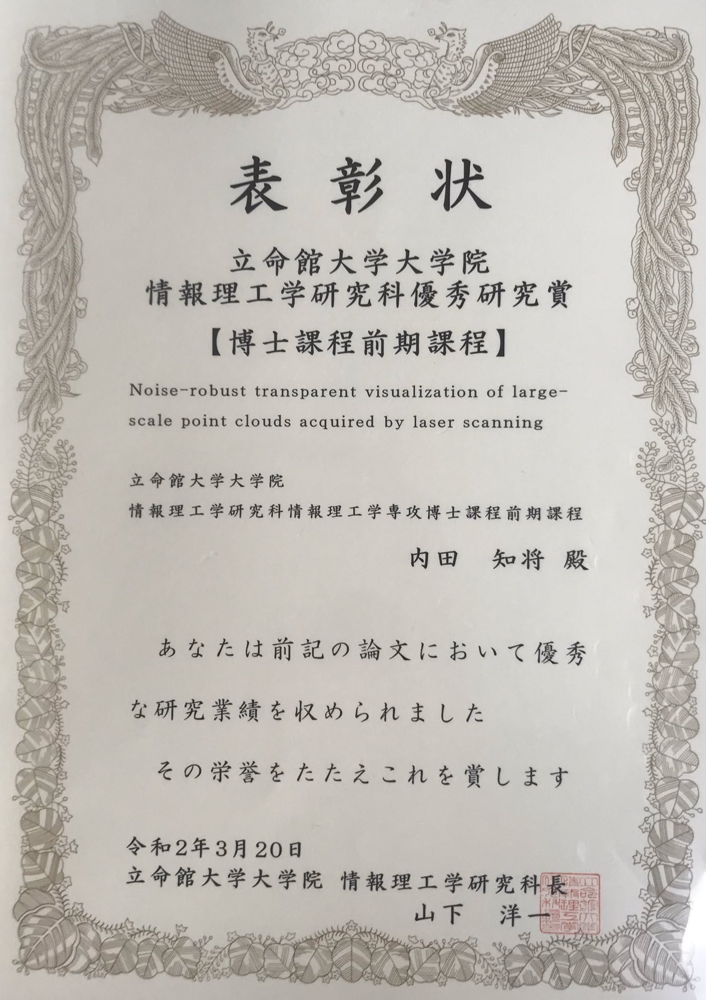
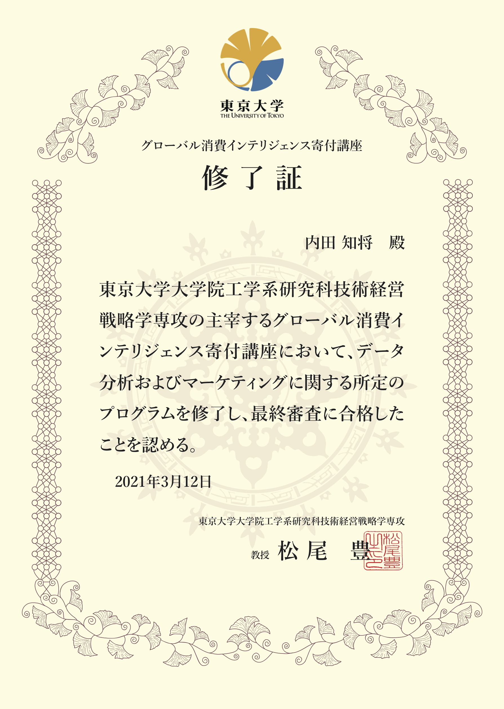

  <b>Tomomasa Uchida</b> 
  (Last updated on Nov. 27, 2021) 
   
   

## About me

I'm a Software Engineer in Minatomirai. I belong to a department called "Solution Platform Development". I mainly use the following techniques:
- Python, Go, GCP

### SNS
- [GitHub](https://github.com/tom-uchida)
- [LinkedIn](https://www.linkedin.com/in/tomomasa-uchida)
- [Wantedly](https://www.wantedly.com/id/tomomasa_uchida)
- [Speaker Deck](https://speakerdeck.com/tom_uchida)
- [Vimeo](https://vimeo.com/tomomasa)
<!-- - [Blog](http://tom0930.hatenablog.com) -->
<!-- - [Twitter](https://twitter.com/tomomasa_JP) -->

 

## Research

### Selected Paper

|Noise-robust transparent visualization of large-scale point clouds acquired by laser scanning|
|:-:|
||
|ISPRS Journal of Photogrammetry and Remote Sensing, vol.161, pp.124-134, March 2020.|
|[h5-index: 77](https://scholar.google.com/citations?hl=en&view_op=search_venues&vq=ISPRS+Journal+of+Photogrammetry&btnG=), [IF: 7.319](https://www.journals.elsevier.com/isprs-journal-of-photogrammetry-and-remote-sensing) (at the time of acceptance)|
|[[paper]](https://doi.org/10.1016/j.isprsjprs.2020.01.004)|

 

## Awards

|Best Award|Best Presentation Award|Best Paper Award|
|:-:|:-:|:-:|
||||
|July 18, 2017|Apr. 19, 2018|Mar. 7, 2019|
|[[video]](https://vimeo.com/219812457), [[slide]](https://speakerdeck.com/tom_uchida/dezitaruatogachuang-richu-suxin-siiti-yan)|[[video]](https://vimeo.com/265704935), [[slide]](https://speakerdeck.com/tom_uchida/interactive-point-cloud-processing-application)|[[poster]](https://github.com/tom-uchida/Academic_Conference/blob/master/The2ndVW/poster/The2ndVW_tuchida_master.jpg)|

|Outstanding Research Award|GCI 2020 Winter|Applied Information Technology Engineer|
|:-:|:-:|:-:|
||||
|Mar. 20, 2020|Mar. 12, 2021|June 25, 2021|
[[paper]](https://doi.org/10.1016/j.isprsjprs.2020.01.004)|[[slide]](https://speakerdeck.com/tom_uchida/gci-2020-winter-final-task)|[None]|

 

## Certifications
|Name|Date|
|:-|:-|
|<b>Deep Learning for GENERAL 2020 #2</b>(JDLA)|July 4, 2020|
|TOEIC Listening & Reading <b>795(L:385, R:410)</b>|Dec. 6, 2020|
|[<b>GCI 2020 Winter</b>(The Universiy of Tokyo)](https://gci.t.u-tokyo.ac.jp/gci2020winter-honors/)|Mar. 12, 2021|
|Applied Information Technology Engineer(IPA)|June 25, 2021|
|[Associate Cloud Engineer(GCP)](https://www.credential.net/80b3f42e-29ae-40be-a26c-0ecb3ccefe07?key=b76aae0516984a241f409600f10a60e8966a771c895ef3e146489f3260898452)|Nov. 23, 2021|