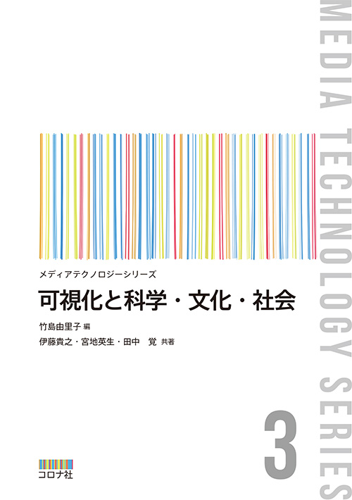

  <b>内田 知将（Tomomasa Uchida）</b>

  

  
  &nbsp;
  
  &nbsp;
  
  &nbsp;
  
  &nbsp;
  

## 職務経歴

### &nbsp;&nbsp;富士フイルムビジネスイノベーション株式会社

#### 
| 関連サービス | 業務内容 | 技術スタック | 期間 |
|:-|:-|:-|:-|
|  | 印刷サービスのバックエンド開発 |    | 2024年7月 - 現在 |
|  | コンテンツサービスのバックエンド開発 |     | 2024年04月 - 現在 |
|  | DDDの技術確立およびコード品質の勉強会主催 |  | 2023年09月 - 2024年03月 |
|  | QRコードを生成するREST API開発 |    | 2022年12月 - 2023年08月 |
|  | Webフロントエンドの技術検証および技術選定 |     | 2022年12月 - 2023年08月 |
|  | Google Cloudへのクラウドリフト |     | 2021年11月 - 2022年11月 |
|  | 運用ツール開発 |   | 2021年07月 - 2021年09月 |

## 資格

| 資格名 | 認定団体 | 取得日 |
|:-|:-|:-|
| 生成AIパスポート | 生成AI活用普及協会| 2024年11月 |
| [Professional Cloud Developer](https://google.accredible.com/fd6356f8-0aab-4d23-85c7-9f3a5a5f4e24?key=15ffabd02c2ef0e12fcfd7ac735480b732f4be6ab77d99d211ceb2057cb498f1) | Google | 2023年07月 |
| [Associate Cloud Engineer](https://www.credential.net/80b3f42e-29ae-40be-a26c-0ecb3ccefe07?key=b76aae0516984a241f409600f10a60e8966a771c895ef3e146489f3260898452) | Google | 2021年11月 |
| 応用情報技術者 | IPA 情報処理推進機構 | 2021年06月 |
| [GCI 2020 Winter 優秀修了生](https://gci2.t.u-tokyo.ac.jp/student) | 東京大学 | 2021年03月 |
| TOEIC Listening & Reading 795(L:385, R:410)|国際ビジネスコミュニケーション協会 | 2020年12月 |
| G検定 2020 #2 | 日本ディープラーニング協会 | 2020年07月 |

## Appendix

### 出版

| 可視化と科学・文化・社会 |
|:-:|
|  |
| 2023年10月10日 |

### ジャーナル論文

|Noise-robust transparent visualization of large-scale point clouds acquired by laser scanning|
|:-:|
||
|ISPRS Journal of Photogrammetry and Remote Sensing, vol.161, pp.124-134, March 2020.|
|[h5-index: 77](https://scholar.google.com/citations?hl=en&view_op=search_venues&vq=ISPRS+Journal+of+Photogrammetry&btnG=), [IF: 7.319](https://www.journals.elsevier.com/isprs-journal-of-photogrammetry-and-remote-sensing) (at the time of acceptance)|
|[[paper]](https://doi.org/10.1016/j.isprsjprs.2020.01.004)|

## 受賞歴

| 最優秀賞  | 最優秀プレゼンテーション賞 | 最優秀論文賞 |
|:-:|:-:|:-:|
||||
| 2017年07月18日 | 2018年04月19日 | 2019年05月07日 |
|[[video]](https://vimeo.com/219812457), [[slide]](https://speakerdeck.com/tom_uchida/dezitaruatogachuang-richu-suxin-siiti-yan)|[[video]](https://vimeo.com/265704935), [[slide]](https://speakerdeck.com/tom_uchida/interactive-point-cloud-processing-application)|[[poster]](https://github.com/tom-uchida/Academic_Conference/blob/master/The2ndVW/poster/The2ndVW_tuchida_master.jpg)|

| 優秀研究賞 | 優秀修了生 | 応用情報技術者 |
|:-:|:-:|:-:|
||||
| 2020年03月20日 | 2021年03月12日 | 2021年06月25日 |
[[paper]](https://doi.org/10.1016/j.isprsjprs.2020.01.004)|[[slide]](https://speakerdeck.com/tom_uchida/gci-2020-winter-final-task)| - |