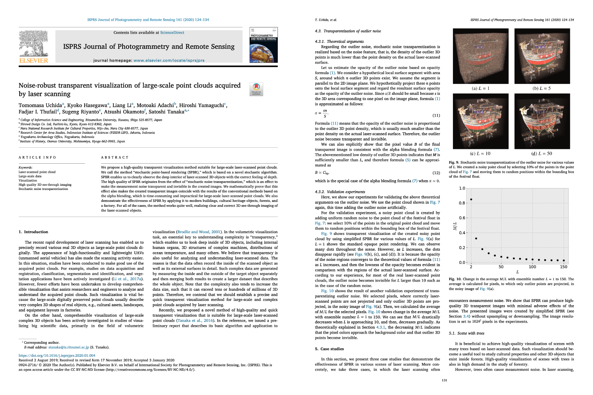

  <b>Tomomasa Uchida</b> 
  <!-- R&D Engineer in Minato Mirai 21, Japan  -->
  (Last updated on Apr. 29, 2021) 
   
   

## About me

### Interests
- Software Development

### SNS
- [GitHub](https://github.com/tom-uchida)
- [LinkedIn](https://www.linkedin.com/in/tomomasa-uchida/)
- [Wantedly](https://www.wantedly.com/id/tomomasa_uchida)
- [Speaker Deck](https://speakerdeck.com/tom_uchida)
- [Vimeo](https://vimeo.com/tomomasa)
<!-- - [Twitter](https://twitter.com/tomomasa_JP) -->
<!-- - [Blog](http://tom0930.hatenablog.com/) -->

 

## Research

### Selected Paper

|Noise-robust transparent visualization of large-scale point clouds acquired by laser scanning|
|:-:|
||
|ISPRS Journal of Photogrammetry and Remote Sensing, vol.161, pp.124-134, March 2020.|
|[h5-index: 77](https://scholar.google.com/citations?hl=en&view_op=search_venues&vq=ISPRS+Journal+of+Photogrammetry&btnG=), [IF: 7.319](https://www.journals.elsevier.com/isprs-journal-of-photogrammetry-and-remote-sensing) (as of 2020)|
|[[paper]](https://doi.org/10.1016/j.isprsjprs.2020.01.004)|

 

## Awards

|Best Award|Best Presentation Award|
|:-:|:-:|
|||
|[[video]](https://vimeo.com/219812457), [[slide]](https://speakerdeck.com/tom_uchida/dezitaruatogachuang-richu-suxin-siiti-yan)|[[video]](https://vimeo.com/265704935), [[slide]](https://speakerdeck.com/tom_uchida/interactive-point-cloud-processing-application)|

|Best Paper Award|Outstanding Research Award|GCI 2020 Winter|
|:-:|:-:|:-:|
||||
|[[poster]](https://github.com/tom-uchida/Academic_Conference/blob/master/The2ndVW/poster/The2ndVW_tuchida_master.jpg)|[[paper]](https://doi.org/10.1016/j.isprsjprs.2020.01.004)|[[slide]](https://speakerdeck.com/tom_uchida/gci-2020-winter-final-task)

 

## Certifications
- [<b>GCI 2020 Winter</b>(Chair for Global Consumer Intelligence, The Universiy of Tokyo)](https://github.com/tom-uchida/GCI2020_Winter/blob/main/%E4%BF%AE%E4%BA%86%E8%A8%BC_GCI2020Winter_%2050.pdf)
- TOEIC Listening & Reading <b>795</b>
- JDLA <b>Deep Learning for GENERAL 2020 #2</b>